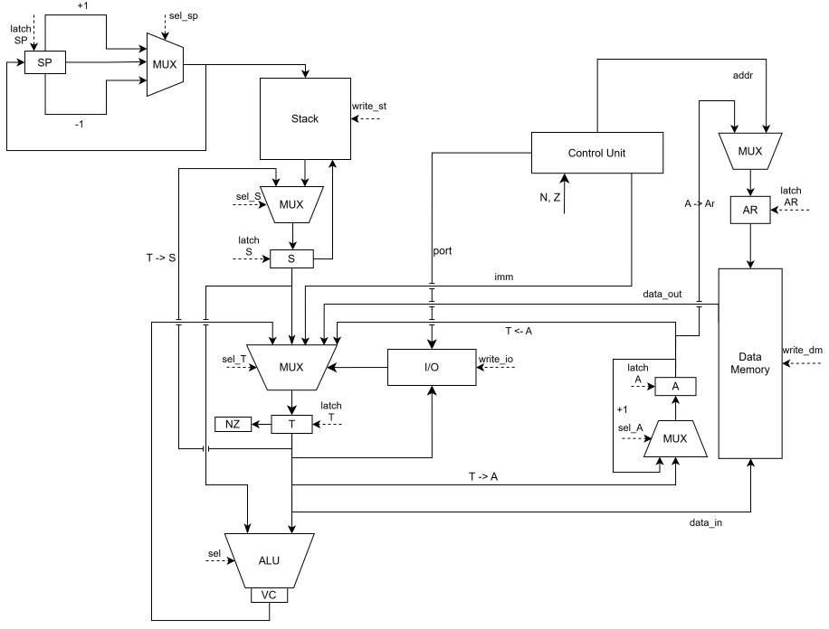
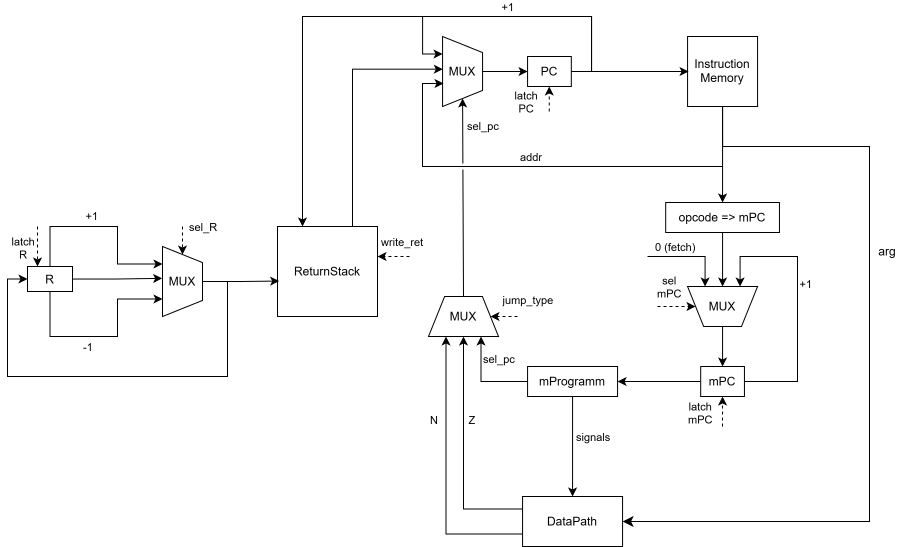

# Translator + processor model for Assembler

- Ковыршин Александр Сергеевич. Группа: P3217
- Преподававтель: Пенской Александр Владимирович.
- ` asm | stack | harv | mc | tick | binary | stream | port | cstr | prob1 | vector `

  
## Язык программирования
### Синтаксис:
``` ebnf
<program> ::= <section_data> <section_text> | <section_text> <section_data> | <section_text>

<section_data> ::= ".data\n" <section_modifier>? <declaration>*
<section_text> ::= ".text\n" <section_modifier>? (<label> | <instruction>)*

<section_modifier> ::= ".org" (" ")+ <number>

<declaration> ::= <label> (<array> | <string>)
<instruction> ::= <label_arg_command> | <number_arg_command> | <without_arg_command>

<label> ::= (<label_name> ":" (" ")*) | (<label_name> ":" (" ")* "\n")

<array> ::= <number> ("," <number>)*
<string> ::= "\"" <char>* "\""

<label_arg_command> ::= ("push" | "store" | "jump" 
| "jz" | "jn" | "call") (" ")+ <label_name>

<number_arg_command> ::= ("pushi" | "input" | "output") (" ")+ <number>
<without_arg_command> ::= ("halt"
                          | "drop" | "dup" | "swap" | "over"
                          | "add" | "sub" | "mul" | "div" | "addc"
                          | "and" | "or" | "not"
                          | "ret" 
                          | "fetchA" | "incA" | "storeA" | "setA" | "getA")

<number> ::= [-2^32; 2^32 - 1]
<char> ::= any ASCII character except '"'
<label_name> ::= (<letter_or_>)+
<letter_or_> ::= <letter> | ("_")
<letter> ::= [a-z] | [A-Z]
``` 

### Семантика команд

- `.text` - секция, в которой все последующие записи интерпретируются как инструкции, их аргументы, метки и комментарии.
- `.data` - секция, в которой объявляются и инициализируются данные, размещаемые в памяти данных.
- `label` - метка, которая является указателем на адрес памяти инструкции за ней (если метка в section .text) или является указателем на первый элемент зарезервированого сегмента памяти (если метка в section .data);
- `.org addr` - метка, которая задает адрес начала текущей секции, используется и для секции инструкции, и для секции данных. Обязан идти после указателя секции или отсутсвовать.
- Команды, которые используют верхушку стека, снимают значение со стека
---

#### Работа с данными

- `push addr` - помещает значение `mem[addr]` на вершину стека.
В силу гарвардской архитектуры `addr` может указывать только на данные (Data Memory).
- `pushi value` - помещает значение `value` на вершину стека.
- `store addr` - извлекает значение с вершины стека и записывает его в `mem[addr]`.
- `fetchA` - помещает значение `mem[A]` на вершину стека.
- `incA` - увеличивает значение регистра `A` на 1.
- `storeA` - записывает значение с вершины стека в `mem[A]`.
- `setA` - записывает значение с вершины стека в `A`.
- `getA` - помещает значение `A` на вершину стека.
---

#### Операции со стеком

- `drop` - удаляет верхний элемент стека.
- `dup` - дублирует верхний элемент стека.
- `swap` - меняет местами два верхних элемента стека.
- `over` - копирует второй элемент стека на вершину.

---

#### Арифметические операции

Операции выполняются над двумя верхними элементами стека.

- `add` - складывает два верхних значения, результат помещается на вершину стека.
- `sub` - вычитает верхний элемент из второго элемента стека, результат помещается на вершину.
- `mul` - перемножает два верхних значения.
- `div` - делит второй элемент стека на верхний элемент, результат помещается на вершину стека.
- `addc` - складывает два верхних значения и флаг C, 
---

#### Логические операции

- `and` - побитовое И двух верхних элементов стека.
- `or` - побитовое ИЛИ двух верхних элементов стека.
- `not` - побитовое отрицание вершины стека.
---

#### Управление потоком выполнения

- `jump label` - безусловно передаёт управление на инструкцию, обозначенную меткой.

- `jz label` - выполняет переход, если значение на вершине стека равно 0.

- `jn label` - выполняет переход, если значение на вершине стека меньше 0.
> Условные переходы проверяют значение на вершине стека и удаляют его.

---

#### Вызовы процедур

- `call label` - сохраняет адрес следующей инструкции в стек вызовов и передаёт управление по метке.
- `ret` - извлекает адрес из стека вызовов и передаёт управление обратно.

---

#### Ввод-вывод

- `input n` - считывает один символ из порта `n` и помещает его на вершину стека.
- `output n` - записывает значение с вершины стека в порт `n`.

---

- `halt` - завершает выполнение программы.

---

В программе не может быть дублирующихся меток.
Метка памяти данных задается на той же строке, что и данные:
``` asm 
hello_world: "Hello, world!"
```

Метка памяти команд задается на строке предшетсвующей инструкции, на которую указывает метка:
``` asm
foo:
    push 10
    ...
```

Метка `.org`, должна идти строго после секции:
```asm
.text
    .org 10
    
.data
    .org 10
```


### Область видимости

Переменные и инструкции видимы из любой части кода

### Типизация, виды литералов

Литералы могут быть представлены в виде чисел и меток (в последствии интерпретируются как числа), в секции .data можно объявлять строки. Типизация отсутсвует, так как пользователь языка может интерпретировать любые данные как захочет и может с ними выполнить любые из возможных операций.

## Организация памяти

Процессор использует гарвардскую архитектуру, поэтому память инструкций и память данных физически разделены.

Машинное слово - 32 бита
### Регистры процессора

```text
                Registers
+----------------------------------+
| T                                |
+----------------------------------+
| S                                |
+----------------------------------+
| A                                |
+----------------------------------+
| SP                               |
+----------------------------------+
| R                                |
+----------------------------------+
| AR                               |
+----------------------------------+
| PC                               |
+----------------------------------+
| mPC                              |
+----------------------------------+
| IR                               |
+----------------------------------+
| Flags: N Z V C                  |
+----------------------------------+
```

Описание регистров:

- `T` - верхний элемент стека;
- `S` - второй элемент стека;
- `A` - дополнительный регистр для удобства программиста
- `SP` - указатель стека данных;
- `R` - указатель стека возвратов;
- `AR` - регистр адреса памяти данных;
- `PC` - счётчик инструкций;
- `mPC` - счётчик микроинструкций;
- `IR` - регистр текущей инструкции;
- `N`, `Z`, `V`, `C` - флаги процессора.

Регистры `T` и `S` используются как кэш верхушки стека, что уменьшает количество обращений к памяти стека.

### Память инструкций

Память инструкций содержит:
- машинный код программы;
- адрес точки входа (`_start`);
- процедуры и переходы.

Каждая инструкция занимает одно машинное слово размером 32 бита.

```text
Instruction memory
+----------------------+
| start address        |
+----------------------+
| instruction 0        |
| instruction 1        |
| ...                  |
+----------------------+
```

### Память данных

Память данных содержит:
- строки;
- массивы;
- глобальные переменные.

Строки хранятся как null-terminated строки (`cstr`):
последовательность ASCII символов, завершаемая нулевым байтом. Каждый символ занимает одно машинное слово.

Массив состоит из элементов, каждый из которых занимает одно машинное слово.

```text
Data memory
+----------------------+
| static strings       |
| arrays               |
| variables            |
| ...                  |
+----------------------+
```

### Стек данных

```text
Data stack
+----------------------+
| ...                  |
| second value (S)     |
| top value (T)        |
+----------------------+
```

### Стек возвратов

Для вызовов процедур используется отдельный стек возвратов.

Регистр `R` хранит индекс вершины стека возвратов.

Стек возвратов используется инструкциями:
- `call`
- `ret`

## Cистема команд

**Особенности процессора:**
- Машинное слово -- знаковое 32-ух битное число;
- Доступ к памяти данных осуществляется по адресу, хранящемуся в специальном регистре `ar` (`adress register`);
- Устройство ввода-вывод: port-mapped
- Поток управления: 
  - Инкрементирование `PC`;
  - Условный/безусловный переход;
  - Адрес из вершины `Call Stack`.

### Набор инструкций

| Инструкция      | Такты | Описание                                                           |
|:----------------|:--|:-------------------------------------------------------------------|
| `push <addr>`   | 2 | `dataStack.push(memory[addr])`                                     |
| `pushi <value>` | 2 | `dataStack.push(value)`                                            |
| `store <addr>`  | 2 | `memory[addr] = dataStack.pop()`                                   |
| `fetchA`        | 2 | `dataStack.push(memory[A])`                                        |
| `incA`          | 1 | `A += 1`                                                           |
| `storeA`        | 2 | `memory[A] = dataStack.pop()`                                      |
| `setA`          | 1 | `A = dataStack.pop()`                                              |
| `getA`          | 2 | `dataStack.push(A)`                                                |
| `drop`          | 1 | `dataStack.pop()`                                                  |
| `dup`           | 2 | `dataStack.push(dataStack.top())`                                  |
| `swap`          | 1 | `swap(dataStack[-1], dataStack[-2])`                               |
| `over`          | 2 | `dataStack.push(dataStack[-2])`                                    |
| `add`           | 1 | `dataStack.push(dataStack.pop() + dataStack.pop())`                |
| `sub`           | 1 | `a = dataStack.pop(); b = dataStack.pop(); dataStack.push(b - a)`  |
| `addc`          | 1 | `dataStack.push(dataStack.pop() + dataStack.pop()) + C`            |
| `mul`           | 1 | `dataStack.push(dataStack.pop() * dataStack.pop())`                |
| `div`           | 1 | `a = dataStack.pop(); b = dataStack.pop(); dataStack.push(b // a)` |
| `and`           | 1 | `dataStack.push(dataStack.pop() & dataStack.pop())`                |
| `or`            | 1 | `dataStack.push(dataStack.pop() \| dataStack.pop())`               |
| `jump <addr>`   | 1 | `PC = addr`                                                        |
| `jz <addr>`     | 1 | `dataStack.pop() == 0 ? PC = addr : PC += 1`                       |
| `jn <addr>`     | 1 | `dataStack.pop() < 0 ? PC = addr : PC += 1`                        |
| `call <addr>`   | 2 | `returnStack.push(PC + 1); PC = addr`                              |
| `ret`           | 1 | `PC = returnStack.pop()`                                           |
| `input <port>`  | 2 | `dataStack.push(inputPorts[port].pop(0))`                          |
| `output <port>` | 1 | `outputPorts[port].append(dataStack.pop())`                        |


### Уровень микроинструкций
| Номер   | Название команды  | Сигналы                                                                                                                                |
|---------|-------------------|----------------------------------------------------------------------------------------------------------------------------------------|
| 0       | Instruction Fetch | sel_mpc_opcode, latch_mPC, latch_IR                                                                                                    |
| 1       | push addr         | sel_AR_CU, latch_AR, sel_SP_next, latch_SP, sel_mpc_next, latch_mpc                                                                    |
| 2       |                   | write_st, sel_S_top, sel_T_mem, latch_S, latch_T, sel_mpc_fetch, latch_mpc, sel_PC_next, latch_PC                                      | 
| 3       | pushi val         | sel_SP_next, latch_SP, sel_mpc_next, latch_mpc                                                                                         | 
| 4       |                   | write_st, sel_S_top, sel_T_imm, latch_S, latch_T, sel_mpc_fetch, latch_mpc, sel_PC_next, latch_PC                                      | 
| 5       | store addr        | sel_AR_CU, latch_AR, sel_mpc_next, latch_mpc                                                                                           |
| 6       |                   | write_dm, sel_T_second, sel_S_stack, sel_SP_prev, latch_SP, latch_S, latch_T, sel_mpc_fetch, latch_mpc, sel_PC_next, latch_PC          |
| 7       | fetchA            | sel_AR_A, latch_AR, sel_SP_next, latch_SP,sel_mpc_next, latch_mpc                                                                      |
| 8       |                   | write_st,  sel_S_top, sel_T_mem, latch_S, latch_T, sel_mpc_fetch, latch_mpc, sel_PC_next, latch_PC                                     | 
| 9       | incA              | sel_A_inc, latch_A, sel_mpc_fetch, latch_mpc, sel_PC_next, latch_PC                                                                    |
| 10      | storeA            | sel_AR_A, latch_AR, sel_mpc_next, latch_mpc                                                                                            |
| 11      |                   | write_dm, sel_T_second, sel_S_stack, sel_SP_prev, latch_SP, latch_S, latch_T, sel_mpc_fetch, latch_mpc, sel_PC_next, latch_PC          |
| 12      | setA              | sel_A_T, sel_T_second, sel_S_stack, sel_SP_prev, latch_A, latch_S, latch_T, latch_SP, sel_mpc_fetch, latch_mpc, sel_PC_next, latch_PC  |
| 13      | getA              | sel_SP_next, latch_SP, sel_mpc_next, latch_mpc                                                                                         |
| 14      |                   | write_st, sel_S_top, sel_T_A, latch_S, latch_T, sel_mpc_fetch, latch_mpc, sel_PC_next, latch_PC                                        | 
| 15      | drop              | sel_T_second, sel_S_stack, sel_SP_prev, latch_SP, latch_S, latch_T, sel_mpc_fetch, latch_mpc, sel_PC_next, latch_PC                    |
| 16      | dup               | sel_SP_next, latch_SP, sel_mpc_next, latch_mpc                                                                                         |
| 17      |                   | write_st, sel_S_top, latch_S, sel_mpc_fetch, latch_mpc, sel_PC_next, latch_PC                                                          |
| 18      | swap              | sel_T_second, sel_S_top, latch_S, latch_T, sel_mpc_fetch, latch_mpc, sel_PC_next, latch_PC                                             |
| 19      | over              | sel_SP_next, latch_SP, sel_mpc_next, latch_mpc                                                                                         |
| 20      |                   | write_st, sel_T_second, sel_S_top, latch_T, latch_S, sel_mpc_fetch, latch_mpc, sel_PC_next, latch_PC                                   |
| 21      | add               | sel_S_stack, sel_SP_prev, alu_add, sel_T_alu, latch_S, latch_SP, latch_T, sel_mpc_fetch, latch_mpc, sel_PC_next, latch_PC              |
| 22      | sub               | sel_S_stack, sel_SP_prev, alu_sub, sel_T_alu, latch_S, latch_SP, latch_T, sel_mpc_fetch, latch_mpc, sel_PC_next, latch_PC              |
| 23      | mul               | sel_S_stack, sel_SP_prev, alu_mul, sel_T_alu, latch_S, latch_SP, latch_T, sel_mpc_fetch, latch_mpc, sel_PC_next, latch_PC              |
| 24      | div               | sel_S_stack, sel_SP_prev, alu_div, sel_T_alu, latch_S, latch_SP, latch_T, sel_mpc_fetch, latch_mpc, sel_PC_next, latch_PC              |
| 25      | and               | sel_S_stack, sel_SP_prev, alu_and, sel_T_alu, latch_S, latch_SP, latch_T, sel_mpc_fetch, latch_mpc, sel_PC_next, latch_PC              |
| 26      | or                | sel_S_stack, sel_SP_prev, alu_or, sel_T_alu, latch_S, latch_SP, latch_T, sel_mpc_fetch, latch_mpc, sel_PC_next, latch_PC               |
| 27      | jump   label      | sel_PC_addr, latch_PC, sel_mpc_fetch, latch_mpc                                                                                        |
| 28      | jz   label        | jump_type_Z, sel_PC_addr, latch_PC, sel_mpc_fetch, latch_mpc                                                                           |
| 29      | jn   label        | jump_type_N, sel_PC_addr, latch_PC, sel_mpc_fetch, latch_mpc                                                                           |
| 30      | call   label      | sel_R_next, latch_R, sel_mpc_next, latch_mpc                                                                                           |
| 31      |                   | write_ret, sel_PC_addr, latch_PC, sel_mpc_fetch, latch_mpc                                                                             |
| 32      | ret               | sel_PC_ret, sel_R_prev, latch_R, latch_PC, sel_mpc_fetch, latch_mpc                                                                    |
| 33      | input n           | sel_SP_next, latch_SP, sel_mpc_next, latch_mpc                                                                                         |
| 34      |                   | write_st, sel_S_top, sel_T_input, latch_S, latch_T, sel_mpc_fetch, latch_mpc, sel_PC_next, latch_PC                                    | 
| 35      | output n          | write_io, sel_T_second, sel_S_stack, sel_SP_prev, latch_A, latch_S, latch_T, latch_SP, sel_mpc_fetch, latch_mpc, sel_PC_next, latch_PC |
| 36      | addc              | sel_S_stack, sel_SP_prev, alu_addc, sel_T_alu, latch_S, latch_SP, latch_T, sel_mpc_fetch, latch_mpc, sel_PC_next, latch_PC             |
| 37      | not               | alu_not, sel_T_alu, latch_T, sel_mpc_fetch, latch_mpc, sel_PC_next, latch_PC                                                           |

### Кодирование инструкций

Типы данных в модуле [isa](./isa.py), где:

- `Opcode` -- перечисление кодов операций;
- `Instruction` -- класс инструкции в себе содержит код инструкции, аргументы, метки, указывающие на эту инструкцию и адрес размещения.
  
#### Бинарное представление

Бинарное представление инструкций:

```text
┌─────────┬─────────────────────────────────────────────────────────────┐
│ 31...24 │ 23                                                        0 │
├─────────┼─────────────────────────────────────────────────────────────┤
│  опкод  │                           операнд                           │
└─────────┴─────────────────────────────────────────────────────────────┘
```

Коды операций:

| Opcode       | Hex    | Инструкция |
|:-------------|:-------|:-----------|
| `00000001`   | `0x01` | `push`     |
| `00000010`   | `0x02` | `pushi`    |
| `00000011`   | `0x03` | `store`    |
| `00000100`   | `0x04` | `fetchA`   |
| `00000101`   | `0x05` | `storeA`   |
| `00000110`   | `0x06` | `setA`     |
| `00000111`   | `0x07` | `getA`     |
| `00001000`   | `0x08` | `incA`     |
| `00010000`   | `0x10` | `drop`     |
| `00010001`   | `0x11` | `dup`      |
| `00010010`   | `0x12` | `swap`     |
| `00010011`   | `0x13` | `over`     |
| `00100000`   | `0x20` | `add`      |
| `00100001`   | `0x21` | `sub`      |
| `00100010`   | `0x22` | `mul`      |
| `00100011`   | `0x23` | `div`      |
| `00100100`   | `0x24` | `addc`     |
| `00110000`   | `0x30` | `and`      |
| `00110001`   | `0x31` | `or`       |
| `00110010`   | `0x32` | `not`      |
| `01000000`   | `0x40` | `jump`     |
| `01000001`   | `0x41` | `jz`       |
| `01000010`   | `0x42` | `jn`       |
| `01000011`   | `0x43` | `call`     |
| `01000100`   | `0x44` | `ret`      |
| `01010000`   | `0x50` | `input`    |
| `01010001`   | `0x51` | `output`   |
| `11111111`   | `0xFF` | `halt`     |

Для инструкций без аргументов поле `operand` должно быть равно `0`.

#### Отладочное представление
Пример:


```text
1 - 50000001 - INPUT 1 
```

## Транслятор

Интерфейс командной строки: `python3 translator.py <input_file> <target_program_file> <target_data_file>`

Первый аргумент - путь до файла с исходным кодом, второй аргумент - путь до файла, куда будут записаны массивы данных, инициализированные в пользовательской программе, в бианрном виде, третий аргумент - путь до файла, куда будут записаны инструкции в бинарном виде.  
Немного видоизменил интерфейс командной строки в связи с Гарвардской архитектурой процессора.

Реализация транслятора: [translator.py](./translator.py)

Этапы трансляции:
1. Препроцессинг:
   - подстановка `#define`
   - обработка условной компиляции `if` / `endif`
   - подстановка макросов `macro`
2. Парсинг исходного кода в массивы секций (у каждой секции свой адрес взятый из `.org`)
   - Инструкции разбиваются на токены, запоминаются метки, идущие непосредственно перед текущей инструкции
   - Создание экземпляра класса `Instruction` или `Variable`, в зависимости от текущей секции, и заполняются поля
   - Получение массива segment_text состоящий из пар значений (адрес секции, массив инструкций в секции)
   - Получение массива segment_data состоящий из пар значений (адрес секции, массив переменных в секции)
3. Присвоение адресов инстукциям
   - Определение точки входа в программу
   - Определение какому адресу соответсвует каждая метка в секци `.text`
4. Присвоение адресов переменным 
5. Генерация машинного кода.
   - Подстановка вместо меток их адреса
   - Получение человекочитаемого формата для инструкций
   - Получение человекочитаемого формата для переменных

Пример использования `#define`
```asm
#define PORT 1

.text
_start:
    pushi 65
    output PORT
    halt
```
После препроцессинга PORT будет заменён на 1.

```asm
#define DEBUG 1

.text

_start:

if DEBUG
    pushi 100
    output 1
endif

    halt
```
Если идентификатор DEBUG определён через #define, блок между if и endif будет включён в итоговую программу.

```asm
macro print value
    pushi value
    output 1
endmacro

.text

_start:
    print 72
    print 105
    halt
```

### Правила генерации машинного кода
- Одиночные числа, объявленные в `.data` должны принимать значения [-2^31; 2^31 - 1];
- Лейбл в секции `.data` задается на той же строке, что и данные. Данные задаются на одной строке;
- Лейбл в секции `.text` задается перед инструкцией, на которую он указывает;
- `.org` если задается, то сразу после обозначения секции (`.data/ .text`);
- На одной строке до одной инструкции;
- Обязательна метка _start;

## Модель процессора

Интерфейс командной строки: `python3 machine.py <code_file> <data_file> <input_file>`

`<input_file>` должен соответсвующему формату:
```text
[]
[1, 2, 3, 5]
[]
```
Каждая строка обозначает порт устройства ввода-вывода
Впоследствии это будет странслировано в `io_ports: dict[int, list[int]]`

Реализация: [machine.py](./machine.py)

### DataPath



Реализован в классе `DataPath`.

Регистры:  
- `T` - верхний элемент стека;
- `S` - второй элемент стека;
- `A` - дополнительный регистр для удобства программиста
- `SP` - указатель стека данных;
- `AR` - регистр адреса памяти данных;

Сигналы:
- Защелки:
  - `latch_T` - защёлкнуть выбранное значение в `T`;
  - `latch_S` - защёлкнуть выбранное значение в `S`;
  - `latch_A` - защёлкнуть выбранное значение в `A`;
  - `latch_SP` - защёлкнуть выбранное значение в `SP`;
  - `latch_AR` - защёлкнуть выбранное значение в `AR`.

- Сигналы записи:
  - `write_io` - запись значения в порт ввода-вывода;
  - `write_dm` - запись значения в память данных;
  - `write_st` - запись значения в стек.

- Мультиплексоры: 
 - `sel_T` - выбор источника данных для регистра `T`
    - `sel_T_second` - значение из регистра `S`;
    - `sel_T_alu` - результат работы АЛУ;
    - `sel_T_imm` - непосредственный аргумент инструкции;
    - `sel_T_A` - значение регистра `A`;
    - `sel_T_mem` - данные из памяти;
    - `sel_T_input` - данные из устройства ввода.

  - `sel_S` - выбор источника данных для регистра `S`
    - `sel_S_stack` - значение из стека;
    - `sel_S_top` - значения регистра `T`.

  - `sel_A` - выбор источника данных для регистра `A`
    - `sel_A_inc` - увеличение значения `A` на единицу;
    - `sel_A_T` - загрузка значения из регистра `T`.

  - `sel_SP` - управление указателем стека
    - `sel_SP_next` - увеличение `SP` на единицу;
    - `sel_SP_prev` - уменьшение `SP` на единицу.

  - `sel_AR` - выбор источника адреса
    - `sel_AR_A` - адрес из регистра `A`;
    - `sel_AR_CU` - адрес из аргумента текущей инструкции.

- АЛУ:
  - `add` - сложение;
  - `sub` - вычитание;
  - `mul` - умножение;
  - `div` - целочисленное деление;
  - `addc` - сложение с переносом;
  - `and` - побитовое И;
  - `or` - побитовое ИЛИ;
  - `not` - побитовое отрицание.

Все операции выполняются в 32-битном формате.

Флаги:
- `N` - отрицательный результат;
- `Z` - нулевой результат;
- `V` - переполнение;
- `C` - перенос/заём.

Флаги `N` и `Z` обновляются при изменении регистра `T`.  
Флаги `V` и `C` обновляются только после выполнения операций АЛУ.  
Флаги используются условными переходами

### ControlUnit



Реализован в классе `ControlUnit`.

ControlUnit отвечает за выполнение микропрограммы и формирование управляющих сигналов DataPath.

Регистры:
- `PC` - счётчик команд;
- `IR` - регистр текущей инструкции;
- `mPC` - счётчик микрокоманд;
- `R` - указатель стека возвратов.

Стек возвратов реализован в виде массива фиксированного размера и используется инструкциями `call` и `ret`.

Сигналы:
- Защелки:
  - `latch_PC` - защёлкнуть выбранное значение в `PC`;
  - `latch_IR` - загрузка текущей инструкции в `IR`;
  - `latch_mPC` - защёлкнуть выбранное значение в `mPC`;
  - `latch_R` - защёлкнуть выбранное значение в `R`.

- Сигналы записи:
  - `write_ret` - запись адреса возврата в стек возвратов.

- Мультиплексоры:

  - `sel_PC` - выбор следующего значения `PC`
    - `sel_PC_next` - переход к следующей инструкции;
    - `sel_PC_addr` - переход по адресу из аргумента инструкции;
    - `sel_PC_ret` - переход по адресу из стека возвратов;
    - `sel_PC_JZ` - переход по адресу при установленном флаге `Z`;
    - `sel_PC_JN` - переход по адресу при установленном флаге `N`.

  - `sel_mPC` - выбор следующего значения `mPC`
    - `sel_mPC_next` - переход к следующей микрокоманде;
    - `sel_mPC_fetch` - переход к стадии выборки инструкции;
    - `sel_mPC_opcode` - переход к микропрограмме текущей инструкции.

  - `sel_R` - управление указателем стека возвратов
    - `sel_R_next` - увеличение `R` на единицу;
    - `sel_R_prev` - уменьшение `R` на единицу.

Микропрограмма хранится в массиве `_microprogram`.

Каждая инструкция процессора представлена последовательностью микрокоманд.  
Микрокоманда состоит из набора управляющих сигналов, выполняемых за один такт.

Выполнение инструкции начинается со стадии выборки:
- загрузка инструкции по адресу `PC` в `IR`;
- переход к микропрограмме соответствующего opcode.

Инструкция `halt` завершает выполнение программы.

## Тестирование

Тестирование реализовано через golden тесты.  
Директория с тестами: [golden](./golden/)  
Исполняемый файл: [test_golden.py](./test_golden.py)

## Тестирование

Тестирование реализовано через golden тесты.  

Директория с тестами:
- [golden](./golden/)

Исполняемый файл:
- [test_golden.py](./test_golden.py)

Реализованы следующие тесты:
- `hello` - вывод строки `Hello world`;
- `cat` - вывод входного потока;
- `hello_user_name` - запрос имени пользователя и вывод приветствия;
- `sort` - сортировка массива чисел;
- `64-bit_operations` - демонстрация арифметики двойной точности;
- `prob1` -  Euler problem 4;

Каждый golden-тест включает:
- бинарный код программы;
- бинарное представление памяти;
- входные данные;
- журналы транслятора;
- журнал работы модели процессора.

Тестирование проверяет:
- корректность трансляции;
- корректность генерации машинного кода;
- корректность выполнения программ;
- корректность микропрограммы;
- корректность состояния процессора на каждом такте.

Запуск тестов:

```shell
pytest .\test_golden.py
```

Пример импользования всей системы

```shell
> python translator.py .\examples\hello.s instruction_memory.bin data_memory.bin
source LoC: 27 code instr: 11
> cat instruction_logs.txt
10 - 0200000a - PUSHI 10 
11 - 06000000 - SET_A  
12 - 04000000 - FETCH_A  
13 - 11000000 - DUP  
14 - 41000012 - JZ 18 
15 - 51000001 - OUTPUT 1 
16 - 08000000 - INCA  
17 - 4000000c - JUMP 12 
18 - 02000000 - PUSHI 0 
19 - 51000001 - OUTPUT 1 
20 - ff000000 - HALT
> cat .\variable_logs.txt                                                 
10 - string: message[0] - 0x68
11 - string: message[1] - 0x65
12 - string: message[2] - 0x6c
13 - string: message[3] - 0x6c
14 - string: message[4] - 0x6f
15 - string: message[5] - 0x20
16 - string: message[6] - 0x77
17 - string: message[7] - 0x6f
18 - string: message[8] - 0x72
19 - string: message[9] - 0x6c
20 - string: message[10] - 0x64
21 - string: message[11] - 0x0
python .\machine.py .\instruction_memory.bin .\data_memory.bin .\input.txt
cat machine.log 

 === TICK 1 ===

  --- MICROINSTRUCTIONS ---
     latch: Signal.LATCH_IR, sel: None
     latch: Signal.LATCH_MPC, sel: Mux_Signal.SEL_MPC_OPCODE
  PC:   10 | MPC:   3 | IR: PUSHI 10     | R:  -1 | SP:  -1 | T:     0 | S:     0 | A:     0 | AR:     0 | N:0 Z:1 V:0 C:0
  STACK: [0, 0, 0, 0, 0, 0, 0, 0, 0, 0]
  RETURN_STACK:   [0, 0, 0, 0, 0, 0, 0, 0, 0, 0]
  IO: {1: []}
  ------------------------------------------------------------
  === TICK 2 ===

  --- MICROINSTRUCTIONS ---
     latch: Signal.LATCH_SP, sel: Mux_Signal.SEL_SP_NEXT
     latch: Signal.LATCH_MPC, sel: Mux_Signal.SEL_MPC_NEXT
  PC:   10 | MPC:   4 | IR: PUSHI 10     | R:  -1 | SP:  -1 | T:     0 | S:     0 | A:     0 | AR:     0 | N:0 Z:1 V:0 C:0
  STACK: [0, 0, 0, 0, 0, 0, 0, 0, 0, 0]
  RETURN_STACK:   [0, 0, 0, 0, 0, 0, 0, 0, 0, 0]
  IO: {1: []}
  ------------------------------------------------------------
  === TICK 3 ===

  --- MICROINSTRUCTIONS ---
     latch: Signal.WRITE_ST, sel: None
     latch: Signal.LATCH_S, sel: Mux_Signal.SEL_S_TOP
     latch: Signal.LATCH_T, sel: Mux_Signal.SEL_T_IMM
     latch: Signal.LATCH_PC, sel: Mux_Signal.SEL_PC_NEXT
     latch: Signal.LATCH_MPC, sel: Mux_Signal.SEL_MPC_FETCH
  PC:   11 | MPC:   0 | IR: PUSHI 10     | R:  -1 | SP:   0 | T:     0 | S:     0 | A:     0 | AR:     0 | N:0 Z:0 V:0 C:0
  STACK: [0, 0, 0, 0, 0, 0, 0, 0, 0, 0]
  RETURN_STACK:   [0, 0, 0, 0, 0, 0, 0, 0, 0, 0]
  IO: {1: []}
  ------------------------------------------------------------
  === TICK 4 ===

  --- MICROINSTRUCTIONS ---
     latch: Signal.LATCH_IR, sel: None
     latch: Signal.LATCH_MPC, sel: Mux_Signal.SEL_MPC_OPCODE
  PC:   11 | MPC:  12 | IR: SET_A None   | R:  -1 | SP:   0 | T:    10 | S:     0 | A:     0 | AR:     0 | N:0 Z:0 V:0 C:0
  STACK: [0, 0, 0, 0, 0, 0, 0, 0, 0, 0]
  RETURN_STACK:   [0, 0, 0, 0, 0, 0, 0, 0, 0, 0]
  IO: {1: []}
  ------------------------------------------------------------
  === TICK 5 ===

  --- MICROINSTRUCTIONS ---
     latch: Signal.LATCH_A, sel: Mux_Signal.SEL_A_T
     latch: Signal.LATCH_T, sel: Mux_Signal.SEL_T_SECOND
     latch: Signal.LATCH_S, sel: Mux_Signal.SEL_S_STACK
     latch: Signal.LATCH_SP, sel: Mux_Signal.SEL_SP_PREV
     latch: Signal.LATCH_PC, sel: Mux_Signal.SEL_PC_NEXT
     latch: Signal.LATCH_MPC, sel: Mux_Signal.SEL_MPC_FETCH
  PC:   12 | MPC:   0 | IR: SET_A None   | R:  -1 | SP:   0 | T:    10 | S:     0 | A:     0 | AR:     0 | N:0 Z:1 V:0 C:0
  STACK: [0, 0, 0, 0, 0, 0, 0, 0, 0, 0]
  RETURN_STACK:   [0, 0, 0, 0, 0, 0, 0, 0, 0, 0]
  IO: {1: []}
  ------------------------------------------------------------
  === TICK 6 ===

  --- MICROINSTRUCTIONS ---
     latch: Signal.LATCH_IR, sel: None
     latch: Signal.LATCH_MPC, sel: Mux_Signal.SEL_MPC_OPCODE
  PC:   12 | MPC:   7 | IR: FETCH_A None | R:  -1 | SP:  -1 | T:     0 | S:     0 | A:    10 | AR:     0 | N:0 Z:1 V:0 C:0
  STACK: [0, 0, 0, 0, 0, 0, 0, 0, 0, 0]
  RETURN_STACK:   [0, 0, 0, 0, 0, 0, 0, 0, 0, 0]
  IO: {1: []}
  ------------------------------------------------------------
  === TICK 7 ===

  --- MICROINSTRUCTIONS ---
     latch: Signal.LATCH_AR, sel: Mux_Signal.SEL_AR_A
     latch: Signal.LATCH_SP, sel: Mux_Signal.SEL_SP_NEXT
     latch: Signal.LATCH_MPC, sel: Mux_Signal.SEL_MPC_NEXT
  PC:   12 | MPC:   8 | IR: FETCH_A None | R:  -1 | SP:  -1 | T:     0 | S:     0 | A:    10 | AR:     0 | N:0 Z:1 V:0 C:0
  STACK: [0, 0, 0, 0, 0, 0, 0, 0, 0, 0]
  RETURN_STACK:   [0, 0, 0, 0, 0, 0, 0, 0, 0, 0]
  IO: {1: []}
  ------------------------------------------------------------
  === TICK 8 ===

  --- MICROINSTRUCTIONS ---
     latch: Signal.WRITE_ST, sel: None
     latch: Signal.LATCH_S, sel: Mux_Signal.SEL_S_TOP
     latch: Signal.LATCH_T, sel: Mux_Signal.SEL_T_MEM
     latch: Signal.LATCH_PC, sel: Mux_Signal.SEL_PC_NEXT
     latch: Signal.LATCH_MPC, sel: Mux_Signal.SEL_MPC_FETCH
  PC:   13 | MPC:   0 | IR: FETCH_A None | R:  -1 | SP:   0 | T:     0 | S:     0 | A:    10 | AR:    10 | N:0 Z:0 V:0 C:0
  STACK: [0, 0, 0, 0, 0, 0, 0, 0, 0, 0]
  RETURN_STACK:   [0, 0, 0, 0, 0, 0, 0, 0, 0, 0]
  IO: {1: []}
  ------------------------------------------------------------
  === TICK 9 ===

  --- MICROINSTRUCTIONS ---
     latch: Signal.LATCH_IR, sel: None
     latch: Signal.LATCH_MPC, sel: Mux_Signal.SEL_MPC_OPCODE
  PC:   13 | MPC:  16 | IR: DUP None     | R:  -1 | SP:   0 | T:   104 | S:     0 | A:    10 | AR:    10 | N:0 Z:0 V:0 C:0
  STACK: [0, 0, 0, 0, 0, 0, 0, 0, 0, 0]
  RETURN_STACK:   [0, 0, 0, 0, 0, 0, 0, 0, 0, 0]
  IO: {1: []}
  ------------------------------------------------------------
  === TICK 10 ===

  --- MICROINSTRUCTIONS ---
     latch: Signal.LATCH_SP, sel: Mux_Signal.SEL_SP_NEXT
     latch: Signal.LATCH_MPC, sel: Mux_Signal.SEL_MPC_NEXT
  PC:   13 | MPC:  17 | IR: DUP None     | R:  -1 | SP:   0 | T:   104 | S:     0 | A:    10 | AR:    10 | N:0 Z:0 V:0 C:0
  STACK: [0, 0, 0, 0, 0, 0, 0, 0, 0, 0]
  RETURN_STACK:   [0, 0, 0, 0, 0, 0, 0, 0, 0, 0]
  IO: {1: []}
  ------------------------------------------------------------
  === TICK 11 ===

  --- MICROINSTRUCTIONS ---
     latch: Signal.WRITE_ST, sel: None
     latch: Signal.LATCH_S, sel: Mux_Signal.SEL_S_TOP
     latch: Signal.LATCH_PC, sel: Mux_Signal.SEL_PC_NEXT
     latch: Signal.LATCH_MPC, sel: Mux_Signal.SEL_MPC_FETCH
  PC:   14 | MPC:   0 | IR: DUP None     | R:  -1 | SP:   1 | T:   104 | S:     0 | A:    10 | AR:    10 | N:0 Z:0 V:0 C:0
  STACK: [0, 0, 0, 0, 0, 0, 0, 0, 0, 0]
  RETURN_STACK:   [0, 0, 0, 0, 0, 0, 0, 0, 0, 0]
  IO: {1: []}
  ------------------------------------------------------------
  === TICK 12 ===

  --- MICROINSTRUCTIONS ---
     latch: Signal.LATCH_IR, sel: None
     latch: Signal.LATCH_MPC, sel: Mux_Signal.SEL_MPC_OPCODE
  PC:   14 | MPC:  28 | IR: JZ 18        | R:  -1 | SP:   1 | T:   104 | S:   104 | A:    10 | AR:    10 | N:0 Z:0 V:0 C:0
  STACK: [0, 0, 0, 0, 0, 0, 0, 0, 0, 0]
  RETURN_STACK:   [0, 0, 0, 0, 0, 0, 0, 0, 0, 0]
  IO: {1: []}
  ------------------------------------------------------------
  === TICK 13 ===

  --- MICROINSTRUCTIONS ---
     latch: Signal.LATCH_PC, sel: Mux_Signal.SEL_PC_JZ
     latch: Signal.LATCH_S, sel: Mux_Signal.SEL_S_STACK
     latch: Signal.LATCH_T, sel: Mux_Signal.SEL_T_SECOND
     latch: Signal.LATCH_SP, sel: Mux_Signal.SEL_SP_PREV
     latch: Signal.LATCH_MPC, sel: Mux_Signal.SEL_MPC_FETCH
  PC:   15 | MPC:   0 | IR: JZ 18        | R:  -1 | SP:   1 | T:   104 | S:   104 | A:    10 | AR:    10 | N:0 Z:0 V:0 C:0
  STACK: [0, 0, 0, 0, 0, 0, 0, 0, 0, 0]
  RETURN_STACK:   [0, 0, 0, 0, 0, 0, 0, 0, 0, 0]
  IO: {1: []}
  ------------------------------------------------------------
  === TICK 14 ===

  --- MICROINSTRUCTIONS ---
     latch: Signal.LATCH_IR, sel: None
     latch: Signal.LATCH_MPC, sel: Mux_Signal.SEL_MPC_OPCODE
  PC:   15 | MPC:  35 | IR: OUTPUT 1     | R:  -1 | SP:   0 | T:   104 | S:     0 | A:    10 | AR:    10 | N:0 Z:0 V:0 C:0
  STACK: [0, 0, 0, 0, 0, 0, 0, 0, 0, 0]
  RETURN_STACK:   [0, 0, 0, 0, 0, 0, 0, 0, 0, 0]
  IO: {1: []}
  ------------------------------------------------------------
  === TICK 15 ===

  --- MICROINSTRUCTIONS ---
     latch: Signal.WRITE_IO, sel: None
     latch: Signal.LATCH_T, sel: Mux_Signal.SEL_T_SECOND
     latch: Signal.LATCH_S, sel: Mux_Signal.SEL_S_STACK
     latch: Signal.LATCH_SP, sel: Mux_Signal.SEL_SP_PREV
     latch: Signal.LATCH_PC, sel: Mux_Signal.SEL_PC_NEXT
     latch: Signal.LATCH_MPC, sel: Mux_Signal.SEL_MPC_FETCH
  OUTPUT[1] <- 104
  PC:   16 | MPC:   0 | IR: OUTPUT 1     | R:  -1 | SP:   0 | T:   104 | S:     0 | A:    10 | AR:    10 | N:0 Z:1 V:0 C:0
  STACK: [0, 0, 0, 0, 0, 0, 0, 0, 0, 0]
  RETURN_STACK:   [0, 0, 0, 0, 0, 0, 0, 0, 0, 0]
  IO: {1: [104]}
                ...
                ...
                ...
  ------------------------------------------------------------
  === TICK 173 ===

  --- MICROINSTRUCTIONS ---
     latch: Signal.LATCH_IR, sel: None
     latch: Signal.LATCH_MPC, sel: Mux_Signal.SEL_MPC_OPCODE
  PC:   20 | MPC:   0 | IR: HALT None    | R:  -1 | SP:   0 | T:     0 | S:     0 | A:    21 | AR:    21 | N:0 Z:1 V:0 C:0
  STACK: [0, 0, 0, 0, 0, 0, 0, 0, 0, 0]
  RETURN_STACK:   [0, 0, 0, 0, 0, 0, 0, 0, 0, 0]
  IO: {1: [104, 101, 108, 108, 111, 32, 119, 111, 114, 108, 100, 0]}
  ------------------------------------------------------------
  HALT

  TOTAL TICK : 173

  FINAL io-ports {1: [104, 101, 108, 108, 111, 32, 119, 111, 114, 108, 100, 0]}
```
